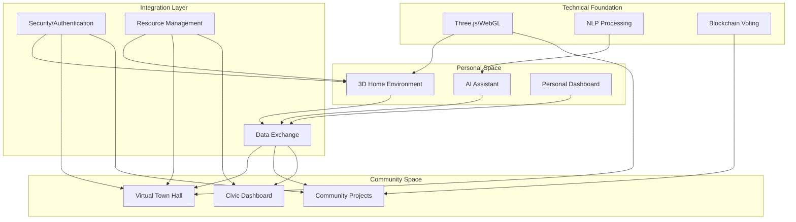

Pretty much everything plus:

1. Creating personalized 3D virtual environments that could serve as individual "home bases" for civic engagement
2. Integrating AI assistants that could help facilitate community participation
3. Using advanced visualization techniques for both personal and community spaces
4. Maintaining strong open-source principles and community-driven development

Let me suggest some ways to integrate these concepts:

Key Integration Points:

1. **Personalized Entry Points**
   - Users access community features through their customized 3D environments
   - AI assistants help navigate both personal and community spaces
   - Seamless transition between private and public virtual areas

2. **Enhanced Visualization**
   - Use your 3D rendering capabilities for both personal spaces and community projects
   - Implement AR/VR features for immersive project visualization
   - Create shared virtual spaces for community meetings

3. **AI-Assisted Civic Engagement**
   - AI assistants could help explain proposals
   - Provide personalized project recommendations
   - Facilitate communication between community members

4. **Unified Data Structure**
   - Integrate personal preferences with community projects
   - Share relevant data between private and public spaces
   - Maintain privacy while enabling collaboration
