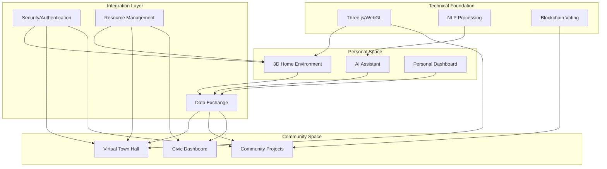

Pretty much everything plus:

1. Creating personalized 3D virtual environments that could serve as individual "home bases" for civic engagement
2. Integrating AI assistants that could help facilitate community participation
3. Using advanced visualization techniques for both personal and community spaces
4. Maintaining strong open-source principles and community-driven development

Key Integration Points:

1. **Personalized Entry Points**
   - Users access community features through their customized 3D environments
   - AI assistants help navigate both personal and community spaces
   - Seamless transition between private and public virtual areas

2. **Enhanced Visualization**
   - Use your 3D rendering capabilities for both personal spaces and community projects
   - Implement AR/VR features for immersive project visualization
   - Create shared virtual spaces for community meetings

3. **AI-Assisted Civic Engagement**
   - AI assistants could help explain proposals
   - Provide personalized project recommendations
   - Facilitate communication between community members

4. **Unified Data Structure**
   - Integrate personal preferences with community projects
   - Share relevant data between private and public spaces
   - Maintain privacy while enabling collaboration

I understand! That's a really self-aware perspective - having a strong vision and being able to judge feasibility is incredibly valuable. Let me suggest a structured next step that builds on your strengths while moving towards implementation.

# Phase 1: Core Infrastructure Development

## 1. Foundation Layer
### 1.1 Basic 3D Environment (4 weeks)
- Set up Three.js environment
- Implement basic room structure
- Create camera controls
- Add basic lighting system
- Develop simple object placement system

### 1.2 User Authentication & Data Structure (3 weeks)
- Design database schema for:
  - User profiles
  - Room configurations
  - Community data
  - Project proposals
- Implement secure authentication system
- Set up initial API endpoints

### 1.3 Basic AI Assistant Framework (5 weeks)
- Implement NLP processing pipeline
- Create basic dialogue management system
- Design initial assistant personality framework
- Develop context awareness system
- Add basic command interpretation

## 2. Integration Features
### 2.1 Personal Space Development (4 weeks)
- Create room customization interface
- Implement object manipulation tools
- Add basic texture and color controls
- Develop saving/loading system
- Add simple preferences management

### 2.2 Community Space Basics (4 weeks)
- Design virtual town hall structure
- Implement basic meeting room functionality
- Create simple voting mechanism
- Add project proposal system
- Develop basic community dashboard

### 2.3 Transition System (2 weeks)
- Design seamless navigation between personal/community spaces
- Implement loading state management
- Create transition animations
- Add context persistence
- Develop state management system

## 3. Testing & Refinement
### 3.1 Initial Testing Phase (2 weeks)
- Develop automated testing suite
- Conduct performance testing
- Implement logging system
- Create debugging tools
- Set up monitoring

### 3.2 User Testing (2 weeks)
- Create test scenarios
- Recruit initial test users
- Gather feedback
- Document issues
- Prioritize improvements

## Required Resources
### Development Team
- 1 Lead Developer (Full-stack)
- 2 Frontend Developers (Three.js, React)
- 2 Backend Developers (Node.js, Python)
- 1 AI/ML Engineer
- 1 UX Designer

### Technology Stack
- Frontend: Three.js, React, WebGL
- Backend: Node.js, Express.js
- Database: MongoDB (user data), PostgreSQL (community data)
- AI: TensorFlow, spaCy
- Cloud: AWS/GCP for scalability

### Development Tools
- Git for version control
- JIRA for project management
- Figma for UI/UX design
- Jest for testing
- Docker for containerization

## Milestones & Deliverables
### Month 1
- Basic 3D environment running
- User authentication system working
- Initial database structure implemented

### Month 2
- Basic AI assistant responding to commands
- Room customization working
- Initial community space accessible

### Month 3
- Integration between personal and community spaces
- Basic voting system implemented
- First round of user testing completed

### Month 4
- Refined user experience based on testing
- Complete basic feature set working
- Ready for beta testing

## Next Steps
1. **Immediate Actions (Week 1)**
   - Set up development environment
   - Create initial project structure
   - Define coding standards
   - Establish git workflow

2. **Team Organization (Week 1-2)**
   - Assign roles and responsibilities
   - Set up communication channels
   - Create development schedule
   - Define review process

3. **Development Kickoff (Week 2)**
   - Begin foundation layer development
   - Set up continuous integration
   - Start documentation process
   - Initialize testing framework

This plan breaks down the first phase into manageable chunks while maintaining the vision of an integrated personal and community space. It focuses on building a solid foundation that can be expanded upon.
